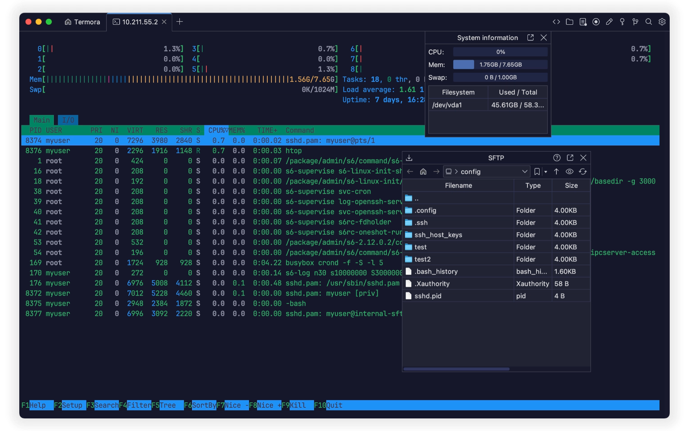
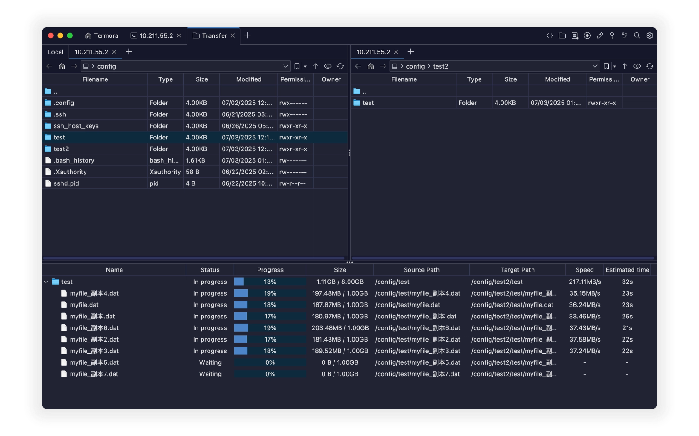
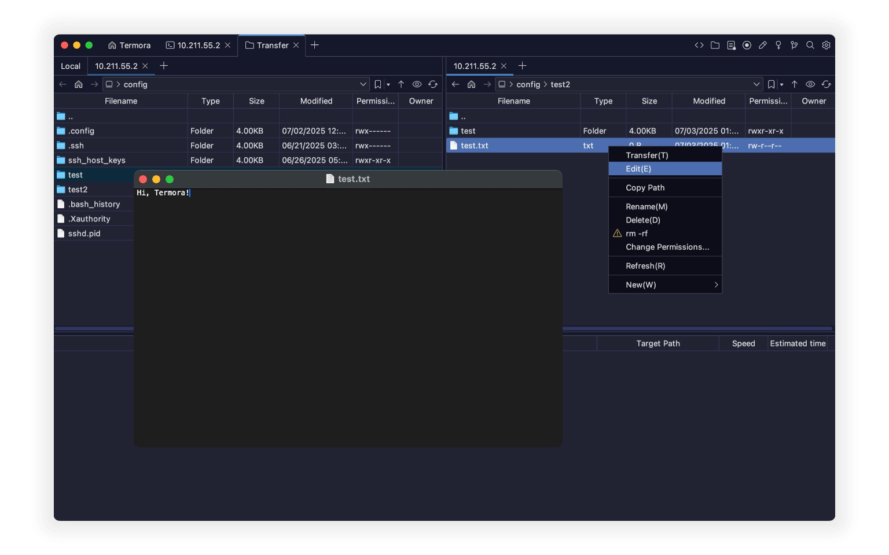
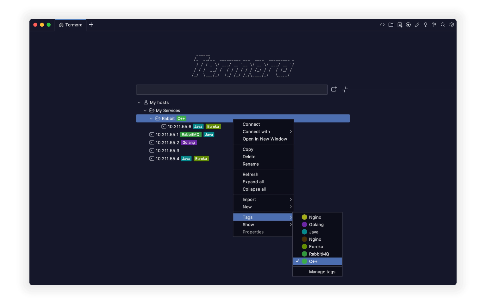

<a href="./README.zh_CN.md">简体中文</a>

# Termora

**Termora** is a cross-platform terminal emulator and SSH client, available on **Windows, macOS, and Linux**.

  

Termora is developed using [**Kotlin/JVM**](https://kotlinlang.org/) and partially implements the [**XTerm control sequence protocol**](https://invisible-island.net/xterm/ctlseqs/ctlseqs.html). Its long-term goal is to achieve **full platform support** (including Android, iOS, and iPadOS) via [**Kotlin Multiplatform**](https://kotlinlang.org/docs/multiplatform.html).

## ✨ Features

- 🧬 Cross-platform support
- 🔐 Built-in key manager
- 🖼️ X11 forwarding
- 🧑‍💻 SSH-Agent integration
- 💻 System information display
- 📁 GUI-based SFTP file management
- 📊 Nvidia GPU usage monitoring
- ⚡ Quick command shortcuts

## 🚀 File Transfer

- Direct transfers between server A ↔ B
- Recursive folder support
- Up to **6 concurrent transfer tasks**

  

## 📝 File Editing

- Auto-upload after editing and saving
- Rename files and folders
- Quick deletion of large folders (`rm -rf` supported)
- Visual permission editing
- Create new files and folders

  

## 💻 Hosts

- Tree-like hierarchical structure, similar to folders
- Assign tags to individual hosts
- Import hosts from other tools
- Open with the transfer tool

  

## 🧩 Plugins

- 🌍 Geo: Display geolocation of hosts
- 🔄 Sync: Sync settings to Gist or WebDAV
- 🗂️ WebDAV: Connect to WebDAV storage
- 📝 Editor: Built-in SFTP file editor
- 📡 SMB:  Connect to [SMB](https://en.wikipedia.org/wiki/Server_Message_Block)
- ☁️ S3: Connect to S3 object storage
- ☁️ Huawei OBS: Connect to Huawei Cloud OBS
- ☁️ Tencent COS: Connect to Tencent Cloud COS
- ☁️ Alibaba OSS: Connect to Alibaba Cloud OSS
- 👉 [View all plugins...](https://www.termora.app/plugins)

## 📦 Download

- 🧾 [Latest Release](https://github.com/TermoraDev/termora/releases/latest)
- 🍺 **Homebrew**: `brew install --cask termora`
- 🔨 **WinGet**: `winget install termora`

## 🛠️ Development

We recommend using the [JetBrainsRuntime](https://github.com/JetBrains/JetBrainsRuntime) JDK for development.

- Run locally: `./gradlew :run`
- Build for current OS: `./gradlew :dist`

## 📄 License

This software is distributed under a dual-license model. You may choose one of the following options:

- **AGPL-3.0**: Use, distribute, and modify the software under the terms of the [AGPL-3.0](https://opensource.org/license/agpl-v3).
- **Proprietary License**: For closed-source or proprietary use, please contact the author to obtain a commercial license.
